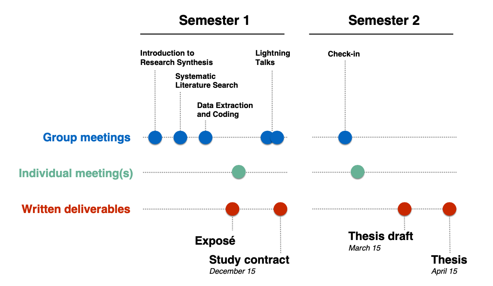

```{r setup, include=FALSE}
knitr::opts_chunk$set(echo = FALSE)

# Learn more about creating websites with Distill at:
# https://rstudio.github.io/distill/website.html

# Learn more about publishing to GitHub Pages at:
# https://rstudio.github.io/distill/publish_website.html#github-pages

```




## Writing a BSc thesis made easy(er)!

This website helps you get an overview of the steps involved in writing a bachelor thesis. It makes available readings and other resources to help you write a BSc thesis consisting of a research synthesis (e.g., rapid review, scoping review, systematic review, systematic review and meta-analysis). The slides for each session are also posted on the site.

Before the start of the semester please take some time to read the [FAQs](https://matarui.github.io/BSc_thesis/FAQ.html) and the Faculty of Psychology's [page](https://psychologie.unibas.ch/de/studium/bachelorstudium/zweites-und-drittes-studienjahr/bachelorarbeit-4190/) on writing a bachelor thesis.

Please note that this site is *work-in-progress* and will be updated on a regular basis and throughout the semester. Please send suggestions for improvement or corrections (e.g., incorrect/missing URLs) via email to the instructor - thank you!

Sessions will take place Tuesdays, **8.15-9.45**, Missionsstrasse 64a, Seminar Room 00.001. 

::: l-body
| # | Date     | Topic                         | Slides |
|---| -------------|-------------------------------|--------|
| 1 | 23.09.2025 | [Introduction to Research Synthesis](session1.html) | [pdf](slides/BachelorCDS_session1.pdf) |
| 2 | 07.10.2025 | [Systematic Literature Search](session2.html) | [pdf](slides/BachelorCDS_session2.pdf)  |
| 3 | 14.10.2025 | [Data Extraction and Coding](session3.html) | [pdf](slides/BachelorCDS_session3.pdf)  |
| 4 | 21.10.2025 | [Individual Meetings](session4.html) |  |
| 5 | 28.10.2025 | [Individual Meetings](session4.html) |  |
| 6 | 04.11.2025 | [Individual Meetings](session4.html) |  |
| 7 | 18.11.2025 | [Student Lightning Talks](session5.html) |  |
| 8 | 25.11.2025 | [Student Lightning Talks](session5.html) |  |
| 9 | 17.02.2026 | [Check-in](index.html) |  |
:::
