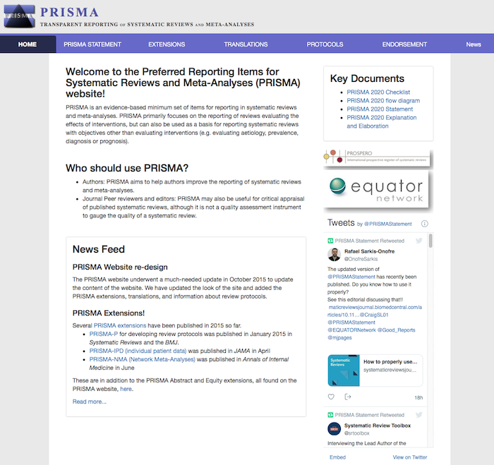

```{r setup, include=FALSE}
knitr::opts_chunk$set(echo = FALSE)
```

{width=700px height=500px}

## PRISMA

Research synthesis should be performed using specific scientific standard to ensure comprehensiveness, transparency, and reproducibility. PRISMA is one such set of guidelines. Are you familiar with the "Preferred Reporting Items for Systematic Reviews and Meta-Analyses (PRISMA)" and the associated [website](http://prisma-statement.org)?

### Reading
Take a few minutes to look into the [website](http://prisma-statement.org/Default.aspx) and skim the paper by Page et al. (2021) referenced below (60 minutes), paying particular attention to the checklist and flow diagrams presented. In addition, read the introduction to systematic search by Atkinson and Cipriani (2018). 

[](http://prisma-statement.org/)

### Exercise

Pick a systematic literature search and/or meta-analysis that you are familiar with or search for one using a database of your choice (e.g., Web of Science, Scopus, PsycInfo, PubMed). To what extent does the report follow the PRISMA guidelines? 

### Guidelines and Resources

The table below lists a few additional resources that may be helpful when conducting a research synthesis using PRISMA, ncluding the Cochrane Handbook for Systematic Reviews of Interventions and the Campbell Collaboration.

::: l-body
| |       
|-----------------------------|--------------------------------------------------------------------|
| PRISMA |The [Preferred Reporting Items for Systematic Reviews and Meta-Analyses](https://prisma-statement.org/) (PRISMA) is used as a reporting standard in systematic reviews and meta-analyses. | 
| Cochrane | The [Cochrane Handbook for Systematic Reviews of Interventions](https://training.cochrane.org/handbook ) provides many useful resources for the process of preparing and writing an evidence synthesis. |
| Campbell Collaboration | The [Campbell Collaboration](https://campbellcollaboration.org/) provides resources for systematic reviews and evidence synthesis in the social sciences. |

:::


### Recommended Readings

Page, M. J., McKenzie, J. E., Bossuyt, P. M., Boutron, I., Hoffmann, T. C., Mulrow, C. D., et al. (2021). The PRISMA 2020 statement: An updated guideline for reporting systematic reviews. *BMJ, 372*, n71. [http://doi.org/10.1136/bmj.n71](https://www.bmj.com/content/372/bmj.n71)

Atkinson, L., & Cipriani, A. (2018). How to carry out a literature search for a systematic review: A practical guide. BJPsych Advances, 24(2), 74-82. [http://doi:10.1192/bja.2017.3](https://www.cambridge.org/core/journals/bjpsych-advances/article/how-to-carry-out-a-literature-search-for-a-systematic-review-a-practical-guide/629E710311A566E54F951E5E83621122)


