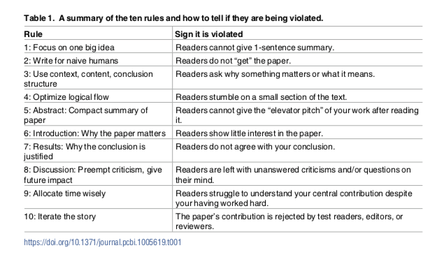

```{r setup, include=FALSE}
knitr::opts_chunk$set(echo = FALSE)
```

## Academic Writing 

{width=700px height=500px}

## Some rules for academic writing 

There are many "rules" concerning academic writing - none are always correct, but some are useful. Mensh and Kording (2017) provide 10 rules that are helpful to keep in mind when writing a piece of academic work, such as an Exposé or a master thesis. 

[](https://github.com/matarui/cds_bsc_HS21/raw/main/docs/literature/Mensh_2017_PLoS_Comput_Biol.pdf)

### Recommended Resources

::: l-body
| |       
|-----------------------------|--------------------------------------------------------------------|
| Zotero | There are many reference managing tools on the market. [Zotero](https://www.zotero.org) is a great and easy one to use. It helps organize your research and manage your materials. The University Library offers some helpful online [tutorials](https://ub.unibas.ch/de/tutorials/) (in German). | 
| Grammarly | If you want to write your bachelor thesis in English, [Grammarly](https://www.grammarly.com) is your AI-based companion. It helps you not only with spelling but also with writing coherent sentences. 
| Turnitin |To check for plagiarism you can use the plagiarism detection software [Turnitin](https://www.turnitin.com). You can access it for free with your University log-in. For more information visit the [University Library](https://ub.unibas.ch/en/plagiarism/) website. 
|APA Style Guide|To write according to the APA format, check out the APA Style Guide Online at [https://apastyle.apa.org/](https://apastyle.apa.org/). |

:::

### Recommended Reading

Mensh, B., & Kording, K. (2017). Ten simple rules for structuring papers. *PLoS Computational Biology, 13*(9), e1005619. [http://doi.org/10.1371/journal.pcbi.1005619](http://doi.org/10.1371/journal.pcbi.1005619)
